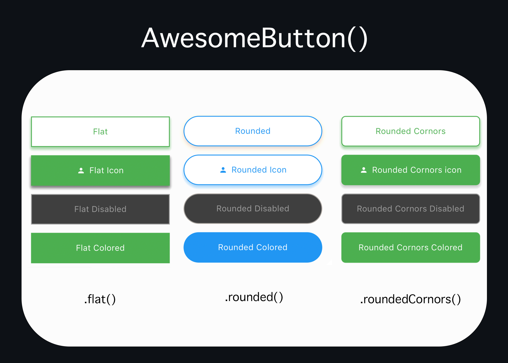
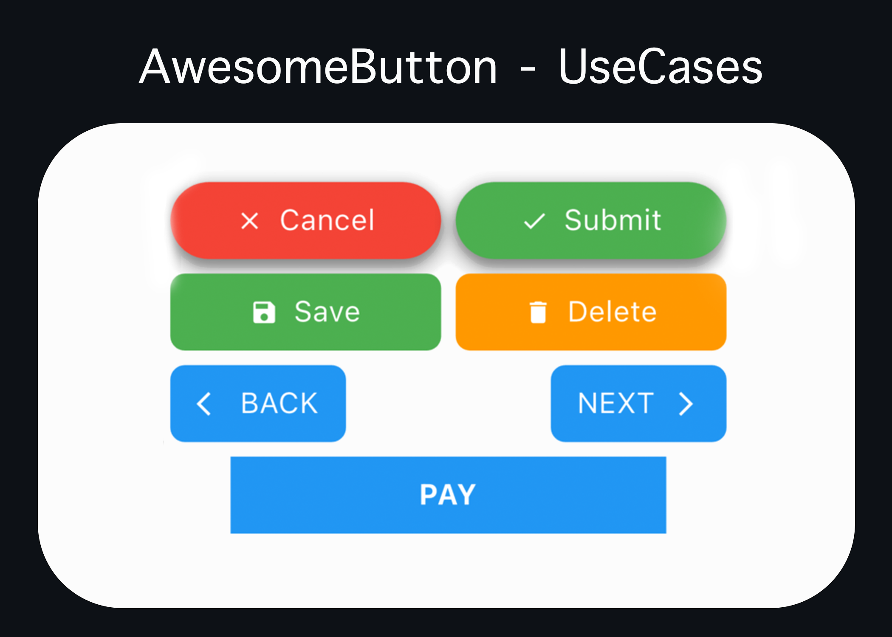

# FLUTTER AWESOME UI KIT(BETA)


## Components
* AwesomeButton
* AwesomeProfileImage
* AwesomeTextBoxed
* AwesomeSnackbar

## AwesomeButton

<p>AwesomeButton offers 3 types of button with number of customizations that can cater to every usecase a developer can ever face using development</p>

### Types
* rounded()
* roundedCornors()
* flat()

### Demo





### Usage

```dart
// Rounded Cornors
AwesomeButton(
    "Rounded Cornors",
    textSize: 20,
    borderColor: Colors.green,
    borderWidth: 2,
    backgroundColor: Colors.white,
    textColor: Colors.green,
    showShadow: true,
    shadowColor: Colors.green,
    enabled: true,
    disabledBackgroundColor: Colors.grey.withOpacity(0.4),
    padding: const EdgeInsets.symmetric(vertical: 20,),
    onClick: () {},
).roundedCornors(),


// Rounded
AwesomeButton(
    "Rounded",
    textSize: 20,
    borderColor: Colors.blue,
    borderWidth: 2,
    backgroundColor: Colors.white,
    textColor: Colors.blue,
    enabled: true,
    showShadow: true,
    shadowColor: Colors.grey,
    disabledBackgroundColor: Colors.grey.withOpacity(0.4),
    padding: const EdgeInsets.symmetric(vertical: 20,),
    onClick: () {},
).rounded(),

// Flat
AwesomeButton(
    "Flat",
    textSize: 20,
    borderColor: Colors.green,
    borderWidth: 2,
    backgroundColor: Colors.white,
    textColor: Colors.green,
    enabled: true,
    disabledBackgroundColor: Colors.grey.withOpacity(0.4),
    padding: const EdgeInsets.symmetric(vertical: 20,),
    onClick: () {},
).flat()
```